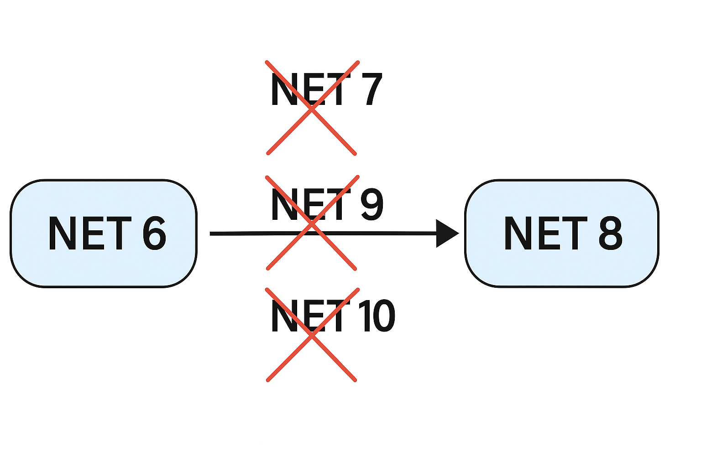

# Migrating my Azure Function App project from .NET 6 to .NET 8

On November 12, 2024, Microsoft announced the end of support for .NET 6. I'm pretty sure they announced it earlier and I just ignored it. However, when the deadline came I decided to go on a journey to migrate from .NET 6 to .NET 8. 

The question you might be asking is, "Why 8? Why not 7, 9, or 10?" I'm the one that asked that question but let's pretend you did. 🤔

<!-- truncate -->

## Why .NET 8? The Million Dollar Question 💰

According to my research, .NET 8 has long-term support (LTS) which will be supported for about the next 3 years (including security patches and reliability fixes). .NET 7 is already out of support as well as of May 14, 2024. .NET 9 is still in preview stages and will also be end of support sooner than .NET 8. .NET 10 is still to be officially released this year in November. 

With all the above brief information, I think we can all agree .NET 8 is the "latest" tested stable version of .NET currently available and there's also a huge community of people running on .NET 8 that can offer support. 

Yeah, because we learn from each other... 🤝



## My Function App: A Brief Overview 📱

I built a web app for my church using Blazor front-end, Function App as a proxy, and SQL Server for data. The app captures people's details - basically an onboarding app. But for this topic, I will focus on a specific functionality. There's a feature for document generation using a C# library called QuestPDF and downloading a document from the UI and storing the document as Base64 in the SQL database.

I have endpoints for generating, storing, and persisting the documents.

Below is some of the code I have on my project and the changes I had to make.

## The Code Journey: Before and After 🔄

### .NET 6 Implementation

**🔧 MyFunctionApp.csproj**
```xml
<Project Sdk="Microsoft.NET.Sdk">

  <PropertyGroup>
    <TargetFramework>net6.0</TargetFramework>
    <AzureFunctionsVersion>v4</AzureFunctionsVersion>
  </PropertyGroup>

  <ItemGroup>
    <PackageReference Include="Microsoft.NET.Sdk.Functions" Version="4.1.1" />
    <PackageReference Include="Microsoft.Data.SqlClient" Version="5.1.5" />
    <PackageReference Include="QuestPDF" Version="2024.3.0" />
  </ItemGroup>

</Project>
```

**📄 Models/DocumentRequest.cs**
```csharp
namespace MyFunctionApp.Models
{
    public class DocumentRequest
    {
        public string Title { get; set; }
        public string Content { get; set; }
    }
}
```

**📄 Services/DocumentService.cs**
```csharp
using Microsoft.Data.SqlClient;

namespace MyFunctionApp.Services
{
    public class DocumentService
    {
        private readonly string _connectionString;

        public DocumentService()
        {
            _connectionString = Environment.GetEnvironmentVariable("SqlConnectionString");
        }

        public async Task SaveDocumentAsync(string fileName, byte[] fileBytes)
        {
            using var conn = new SqlConnection(_connectionString);
            await conn.OpenAsync();

            var cmd = new SqlCommand("INSERT INTO Documents (FileName, Content) VALUES (@FileName, @Content)", conn);
            cmd.Parameters.AddWithValue("@FileName", fileName);
            cmd.Parameters.AddWithValue("@Content", fileBytes);
            await cmd.ExecuteNonQueryAsync();
        }
    }
}
```

**📄 Functions/GenerateDocumentFunction.cs**
```csharp
using System.IO;
using Microsoft.AspNetCore.Mvc;
using Microsoft.Azure.WebJobs;
using Microsoft.Azure.WebJobs.Extensions.Http;
using Microsoft.AspNetCore.Http;
using Microsoft.Extensions.Logging;
using MyFunctionApp.Models;
using MyFunctionApp.Services;
using QuestPDF.Fluent;
using QuestPDF.Infrastructure;
using System.Text.Json;

namespace MyFunctionApp.Functions
{
    public static class GenerateDocumentFunction
    {
        [FunctionName("GenerateDocument")]
        public static async Task<IActionResult> Run(
            [HttpTrigger(AuthorizationLevel.Function, "post")] HttpRequest req,
            ILogger log)
        {
            string requestBody = await new StreamReader(req.Body).ReadToEndAsync();
            var data = JsonSerializer.Deserialize<DocumentRequest>(requestBody);

            if (data == null)
                return new BadRequestObjectResult("Invalid input.");

            byte[] pdfBytes = GeneratePdf(data.Title, data.Content);
            string fileName = $"{data.Title}_{DateTime.UtcNow:yyyyMMddHHmmss}.pdf";

            var documentService = new DocumentService();
            await documentService.SaveDocumentAsync(fileName, pdfBytes);

            return new OkObjectResult("PDF generated and saved to DB.");
        }

        private static byte[] GeneratePdf(string title, string content)
        {
            return Document.Create(container =>
            {
                container.Page(page =>
                {
                    page.Margin(40);
                    page.Header().Text(title).FontSize(24).Bold().AlignCenter();
                    page.Content().Text(content).FontSize(14).LineHeight(1.5f);
                    page.Footer().AlignCenter().Text(x =>
                    {
                        x.CurrentPageNumber();
                        x.Span(" / ");
                        x.TotalPages();
                    });
                });
            }).GeneratePdf();
        }
    }
}
```

**✅ local.settings.json**
```json
{
  "IsEncrypted": false,
  "Values": {
    "AzureWebJobsStorage": "UseDevelopmentStorage=true",
    "FUNCTIONS_WORKER_RUNTIME": "dotnet",
    "SqlConnectionString": "Server=localhost;Database=MyDb;User Id=sa;Password=YourPassword123;"
  }
}
```

### .NET 8 Implementation

**🔧 MyFunctionApp.csproj**
```xml
<Project Sdk="Microsoft.NET.Sdk">

  <PropertyGroup>
    <TargetFramework>net8.0</TargetFramework>
    <OutputType>Exe</OutputType>
  </PropertyGroup>

  <ItemGroup>
    <PackageReference Include="Microsoft.Azure.Functions.Worker" Version="1.18.0" />
    <PackageReference Include="Microsoft.Azure.Functions.Worker.Sdk" Version="1.18.0" OutputItemType="Analyzer" />
    <PackageReference Include="Microsoft.Azure.Functions.Worker.Extensions.Http" Version="3.1.0" />
    <PackageReference Include="Microsoft.Data.SqlClient" Version="5.1.5" />
    <PackageReference Include="QuestPDF" Version="2024.3.0" />
  </ItemGroup>

</Project>
```

**📄 Models/DocumentRequest.cs**
```csharp
namespace FunctionApp.Models;

public class DocumentRequest
{
    public string Title { get; set; }
    public string Content { get; set; }
}
```

**📄 Services/DocumentService.cs**
```csharp
using Microsoft.Data.SqlClient;

namespace FunctionApp.Services;

public class DocumentService
{
    private readonly string _connectionString;

    public DocumentService()
    {
        _connectionString = Environment.GetEnvironmentVariable("SqlConnectionString");
    }

    public async Task SaveDocumentAsync(string fileName, byte[] content)
    {
        using var conn = new SqlConnection(_connectionString);
        await conn.OpenAsync();

        var cmd = new SqlCommand("INSERT INTO Documents (FileName, Content) VALUES (@FileName, @Content)", conn);
        cmd.Parameters.AddWithValue("@FileName", fileName);
        cmd.Parameters.AddWithValue("@Content", content);
        await cmd.ExecuteNonQueryAsync();
    }
}
```

**📄 Functions/GenerateDocumentFunction.cs**
```csharp
using Microsoft.Azure.Functions.Worker;
using Microsoft.Azure.Functions.Worker.Http;
using Microsoft.Extensions.Logging;
using FunctionApp.Models;
using FunctionApp.Services;
using QuestPDF.Fluent;
using QuestPDF.Infrastructure;
using System.Net;
using System.Text.Json;

namespace FunctionApp.Functions;

public class GenerateDocumentFunction
{
    private readonly ILogger _logger;

    public GenerateDocumentFunction(ILoggerFactory loggerFactory)
    {
        _logger = loggerFactory.CreateLogger<GenerateDocumentFunction>();
    }

    [Function("GenerateDocument")]
    public async Task<HttpResponseData> Run(
        [HttpTrigger(AuthorizationLevel.Function, "post")] HttpRequestData req)
    {
        var data = await JsonSerializer.DeserializeAsync<DocumentRequest>(req.Body);

        if (data == null || string.IsNullOrWhiteSpace(data.Title))
        {
            var badResponse = req.CreateResponse(HttpStatusCode.BadRequest);
            await badResponse.WriteStringAsync("Invalid input.");
            return badResponse;
        }

        byte[] pdfBytes = GeneratePdf(data.Title, data.Content);
        string fileName = $"{data.Title}_{DateTime.UtcNow:yyyyMMddHHmmss}.pdf";

        var documentService = new DocumentService();
        await documentService.SaveDocumentAsync(fileName, pdfBytes);

        var response = req.CreateResponse(HttpStatusCode.OK);
        await response.WriteStringAsync("PDF generated and saved to DB.");
        return response;
    }

    private static byte[] GeneratePdf(string title, string content)
    {
        return Document.Create(container =>
        {
            container.Page(page =>
            {
                page.Margin(40);
                page.Header().Text(title).FontSize(24).Bold().AlignCenter();
                page.Content().Text(content).FontSize(14).LineHeight(1.5f);
                page.Footer().AlignCenter().Text(x =>
                {
                    x.CurrentPageNumber();
                    x.Span(" / ");
                    x.TotalPages();
                });
            });
        }).GeneratePdf();
    }
}
```

**✅ local.settings.json**
```json
{
  "IsEncrypted": false,
  "Values": {
    "AzureWebJobsStorage": "UseDevelopmentStorage=true",
    "FUNCTIONS_WORKER_RUNTIME": "dotnet-isolated",
    "SqlConnectionString": "Server=localhost;Database=MyDb;User Id=sa;Password=YourPassword123;"
  }
}
```

**📄 Program.cs** (New in .NET 8)
```csharp
using Microsoft.Extensions.Hosting;
using Microsoft.Azure.Functions.Worker;

var host = new HostBuilder()
    .ConfigureFunctionsWorkerDefaults()
    .Build();

host.Run();
```

## Breaking Down the Changes 🧠

From the above, we might have taken note of some code changes that had to happen. Let me just take you through the changes and why:

### 1. Runtime Model Change

| .NET 6 (In-Process) | .NET 8 (Isolated Worker) |
|---------------------|---------------------------|
| Runs inside the same process as the Azure Functions host | Runs in a separate process (decoupled from host) |
| Uses `Microsoft.NET.Sdk.Functions` | Uses `Microsoft.Azure.Functions.Worker.Sdk` |
| Accesses `HttpRequest` / `HttpResponse` directly | Uses `HttpRequestData` / `HttpResponseData` wrappers |

The reason for the above is .NET 8 moved to the isolated worker model as default to enable better separation of concerns, version independence, and more control over DI and startup logic. I have explained what dependency injection is in my previous post - you can go ahead and read about it if you want. Here is the link: [Understanding Dependency Injection in C#](https://mongezikasha.blog/blog/dependency-injection-csharp).

### 2. Project File (.csproj) Differences

There are obviously some differences in the csproj file between .NET 6 and 8. Here's why:

- Isolated model uses Worker SDK instead of the Functions SDK
- Adds `Microsoft.Azure.Functions.Worker` and explicitly references the HTTP extension
- Output is an executable, hence `OutputType` is set to `Exe`

### 3. Startup & Dependency Injection

| .NET 6 | .NET 8 (Isolated) |
|--------|-------------------|
| DI done via `Startup.cs` and `IFunctionsHostBuilder` | DI handled in `Program.cs` using `Host.CreateDefaultBuilder` |
| Uses `builder.Services.AddXyz()` in `Configure` | Uses `builder.ConfigureFunctionsWorkerDefaults()` with `Services.AddXyz()` |

The above is because .NET 8 follows a modern generic host pattern, same as ASP.NET Core.

### 4. Function Bindings & Method Signatures

| Aspect | .NET 6 | .NET 8 (Isolated) |
|--------|--------|-------------------|
| Attribute | `[FunctionName("Xyz")]` | `[Function("Xyz")]` |
| Request Type | `HttpRequest` from `Microsoft.AspNetCore.Http` | `HttpRequestData` from `Microsoft.Azure.Functions.Worker.Http` |
| Response Type | `IActionResult` / `HttpResponseMessage` | `HttpResponseData` |
| Body Deserialization | `await req.ReadFromJsonAsync<T>()` | `JsonSerializer.DeserializeAsync<T>(req.Body)` |

**Why:**
In isolated model, you don't have access to `HttpRequest`, you use `HttpRequestData` instead. Deserialization is manual unless you build abstractions.

### 5. Logging

| .NET 6 | .NET 8 (Isolated) |
|--------|-------------------|
| Uses `ILogger<T>` injected into function | Uses `ILogger<T>` via constructor injection or DI |
| Logging behavior tied closely to host runtime | More flexible and can integrate with any logging framework (Isolation) |

### 6. PDF Generation Flow

On this one, the logic is pretty much the same, but I just wanted to highlight how I access the request and respond back to the client.

### 7. Output Type & Entry Point

| .NET 6 | .NET 8 |
|--------|--------|
| No `Program.cs` — Azure handles entry | You must define `Program.cs` with `Host.CreateDefaultBuilder()` |

## Summary of Major Code Differences

| Category | .NET 6 (In-Process) | .NET 8 (Isolated Worker) | Why Change? |
|----------|---------------------|---------------------------|-------------|
| SDK | Functions SDK | Worker SDK | Isolated = decoupled runtime |
| Runtime Binding | ASP.NET `HttpRequest` | `HttpRequestData` | New pipeline |
| DI | `Startup.cs` | `Program.cs` | Generic Host |
| Logging | Built into Functions runtime | Customizable, injected | More flexible |
| Response Type | `IActionResult` | `HttpResponseData` | Streamlined & customizable |
| PDF Handling | Same | Same | Logic unchanged |
| SQL Access | Same via `SqlConnection` | Same | Reusable logic |
| Function Attribute | `[FunctionName]` | `[Function]` | SDK syntax |

## Conclusion 🎉

Just like that, we have upgraded our function to .NET 8! The migration process wasn't too painful, but it required understanding the shift from in-process to isolated worker model. The benefits include better separation of concerns, improved testability, and future-proofing with LTS support.

If you're still running on .NET 6, I highly recommend making the jump to .NET 8. Your future self will thank you! 😊

**Please subscribe to my YouTube channel and watch me write terrible code - you'll feel better about your coding skills!** [YouTube Channel](https://youtube.com/@mongezikasha)

## References 📚

- [Microsoft Learn: Upgrade Function App from .NET 6 to .NET 8](https://learn.microsoft.com/en-us/answers/questions/2152147/upgrade-function-app-from-asp-net-6-to-asp-net-8)
- Picture generation is from ChatGPT 4.0

---

*Have you migrated your Azure Functions to .NET 8 yet? Share your experience in the comments below! 👇*
